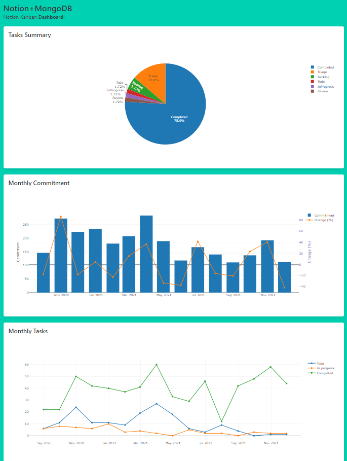

# Notion Kanban Automation

This repo contains Azure Functions project which will automatically reads all cards from Notion database (in this case kanban board) and then store it into MongoDB Serverless Instance. Not only that, my kanban has several properties to make it more informative like story points, priority, and category, making it somwehat like a JIRA board.

## The Idea

I use Notion Kanban extensively to track my daily task and at the end of every month, I'll create a report to get a summary of my work for a whole month. This way I can manage my work-life balance more efficiently.

At first it was fun to setup the kanban board and create my first report, but doing it repeatedly every month is cumbersome. So I wanted to automate this process and create a simple dashboard that I can visit anytime.

MongoDB Hackathon came in just the right time for me to explore serverless technology (in this case Azure Functions and MongoDB Serverless Instance) to automate this reporting task and store the data into a database.

How this app works in Azure Functions:

```
Timer trigger (every month) -> Load pages from Notion -> Save to MongoDB

HTTP trigger (api) -> Load data from MongoDB -> Return as JSON

HTTP trigger (dashboard) -> Return stored static HTML (graph.html) -> Fetch from /api/data -> Visualize using Plotly
```

## Running the App

You'll need .NET 6 or Visual Studio 2022. Clone this repo, then create new `.env` from the example file, then start this app by pressing `F5` in Visual Studio (or Code).

Don't forget to create MongoDB instance and store the connection string into your `.env`. To get Notion authorization token, follow [this guide](https://developers.notion.com/docs/authorization). I use internal integration method.

## Dashboard

Live app: [API](https://fahminotionautomation.azurewebsites.net/api/data) [Dashboard](https://fahminotionautomation.azurewebsites.net/api/dashboard)

For the dashboard, I used Plotly and Bulma CSS. I'm not good with frontend, but I tried :D



## Tech

- [MongoDB Atlas (serverless)](https://docs.atlas.mongodb.com/tutorial/create-new-serverless-instance/)
- [Azure Functions](https://azure.microsoft.com/en-us/services/functions/)
- [Notion](https://www.notion.so/)
